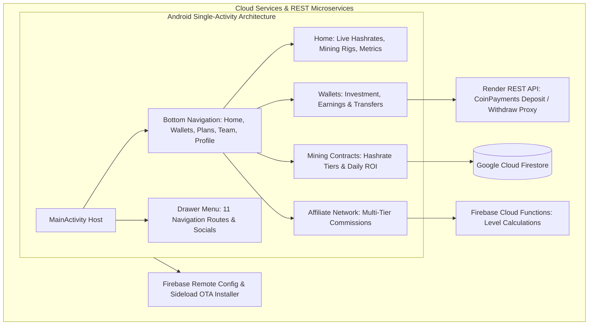

# MinerXGlobal — Android Cloud Mining & Investment Portfolio Client

[](https://kotlinlang.org)
[](https://developer.android.com)
[](https://gradle.org)
[](https://firebase.google.com)
[](LICENSE)

MinerXGlobal is an advanced native Android cryptocurrency cloud mining and investment portfolio management application built with modern Kotlin, Jetpack Navigation, custom OpenGL/Canvas particle animations, and Firebase serverless cloud architecture.

---

## Application Architecture



---

## Key Features

- **Mining Contract Tier Engine**: Dynamic calculation and real-time streaming of daily mining yield (ROI%), package durations, and direct sponsor bonuses.
- **Dual Wallet Architecture**: Clear separation of Investment Capital and Mining Yield Wallets with internal balance transfer workflows.
- **Secure Crypto Deposit & Withdrawal Proxy**: Integration with CoinPayments via dedicated Render backend proxy for automated USDT deposit invoice creation and withdrawal processing.
- **Gamified Lucky Draw Wheel**: Custom canvas-rendered interactive spin-the-wheel reward mechanism backed by Firestore pools.
- **OTA Sideload Self-Updater**: Integrated APK download manager with SHA-256 integrity verification via Firebase Remote Config.

---

## Technical Stack

| Component | Library / Framework | Version |
|---|---|---|
| **Language** | Kotlin | 2.1.10 |
| **Build System** | Android Gradle Plugin / Gradle | 8.10.1 / 8.11.1 |
| **SDK Levels** | Compile SDK: 35, Target SDK: 35, Min SDK: 24 | Android 7.0+ |
| **Navigation & UI** | Jetpack Navigation Component + ViewBinding + DrawerLayout | 2.9.0 |
| **Cloud Services** | Firebase Auth, Firestore, Cloud Functions, Remote Config, Storage | Firebase BoM 33.15.0 |
| **Networking & HTTP** | OkHttp3 + Volley + Gson + Moshi | 4.12.0 / 2.12.1 |
| **Visual Effects & Animations** | Airbnb Lottie, Shimmer, OpenGL particle shaders | 6.5.2 |

---

## Setup & Local Development

### Prerequisites
- Android Studio Ladybug (2024.2.1+) or newer
- JDK 17 / Java 11 runtime
- Android SDK 35 installed

### Step-by-Step Configuration

1. **Clone the Repository:**
   ```bash
   git clone https://github.com/shayann07/MinerXGlobal-User.git
   cd MinerXGlobal-User
   ```

2. **Configure Firebase Credentials:**
   Copy the example configuration template:
   ```bash
   cp app/google-services.json.example app/google-services.json
   ```

3. **Configure Local SDK:**
   ```bash
   cp local.properties.example local.properties
   ```

4. **Build the Application:**
   ```bash
   ./gradlew assembleDebug
   ```

---

## Repository Structure

```
MinerXGlobal-User/
├── app/
│   ├── src/main/
│   │   ├── java/com/minerxgloble/minerxgloble/
│   │   │   ├── adapters/       # 19 Recycler & ViewPager adapters
│   │   │   ├── fcm/            # Push notification & FCM token services
│   │   │   ├── models/         # 31 Data models (User, Plan, Wallet, etc.)
│   │   │   ├── repos/          # 11 Repositories (Auth, BuyPlan, Wallet, Transaction)
│   │   │   ├── ui/             # MainActivity, 27 Fragments, 16 ViewModels
│   │   │   └── utils/          # Constants, RemoteUpdateManager, SharedPrefs
│   │   ├── res/                # ~90 layouts, animations, navigation graph
│   │   └── AndroidManifest.xml # FileProvider, deep links, permissions
│   ├── google-services.json.example
│   └── build.gradle.kts
├── local.properties.example
├── LICENSE                     # MIT License
└── README.md
```

---

## License

Distributed under the MIT License. See [LICENSE](LICENSE) for more information.

Copyright (c) 2026 **shayann07**
