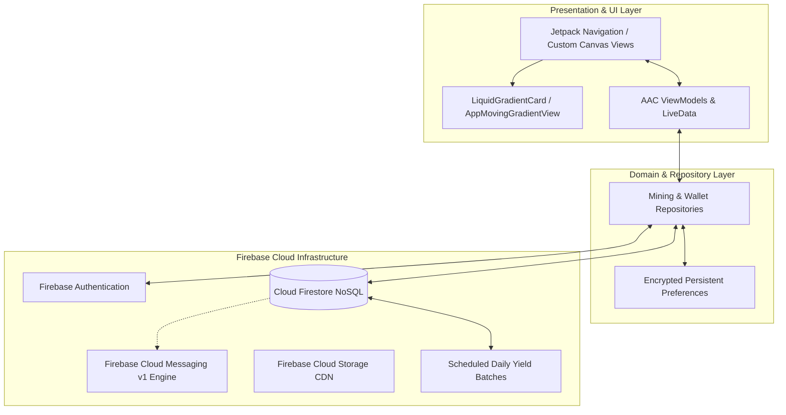
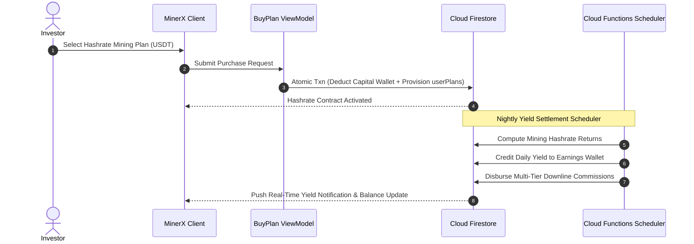

# MinerX Global (User Client)

[](https://developer.android.com)
[](https://kotlinlang.org/)
[](https://developer.android.com)
[](https://developer.android.com/topic/architecture)
[](https://firebase.google.com/docs/firestore)
[](LICENSE)

> Cutting-edge Android cloud mining and staking client featuring dual-wallet accounting (Capital vs Earnings), liquid mesh gradient UI animations, Lucky Draw reward wheels, rank tiers, and automated crypto settlement.

---

## 📖 Overview

**MinerX Global User** is a specialized Android fintech application designed for cloud crypto mining enthusiasts and network builders. Built with **Kotlin**, **MVVM**, **Jetpack Navigation SafeArgs**, and custom canvas UI components (`LiquidGradientCard`, `AppMovingGradientView`), the application provides investors with real-time hashrate contract purchasing, daily yield accruals, gamified Lucky Draw prizes, rank career ladders, and multi-tier affiliate rewards.

### Core Value Propositions
- **Cloud Mining & Staking Contracts**: Purchase fixed-duration hashrate contracts offering predictable daily mining returns and principal liquidation upon completion.
- **Dual-Wallet Architecture**: Transparent separation between Principal Investment Capital and Daily Mining Yields with instant internal balance conversions.
- **Gamified Lucky Draw Experience**: Interactive physics-based prize wheel connected to live Firestore prize pools and real-time winners feeds.
- **Network Rank Tiers & Executive Salaries**: Progress across formal rank levels unlocking performance bonuses and recurring monthly executive stipends.
- **Real-Time Live Chat & Direct Support**: 1-on-1 customer service messaging channel backed by Firestore snapshot streams and FCM v1 push messaging.

---

## 🏗️ Architecture & Operations Flow



### Mining Contract & Daily Accrual Sequence



---

## ✨ Core Features

### 1. ⚡ Cloud Mining Contracts & Staking
- **Hashrate Packages**: Explore curated mining tiers with defined daily percentage yields, duration periods, and capital renewal terms.
- **Active Contract Monitor**: Real-time overview of active rigs, accumulated yields, days remaining, and estimated total maturity payout.

### 2. 👛 Dual-Wallet Accounting
- **Capital Wallet**: Dedicated storage for deposited funds allocated toward hashrate purchases.
- **Earnings Wallet**: Accumulates daily mining profits, affiliate commissions, and salary stipends with one-tap withdrawal workflows.

### 3. 🎡 Lucky Draw & Live Winners Feed
- **Interactive Prize Wheel**: Spin-the-wheel game granting bonus crypto vouchers and cash rewards.
- **Live Winners Ticker**: Real-time broadcast displaying latest community prize winners.

### 4. 🏆 Rank Career Ladder & Monthly Salaries
- **Tiered Rank Hierarchy**: Ascend rank milestones based on total downstream active turnover and network recruitment.
- **Salary Tier Distribution**: Automated monthly stipend disbursement for qualified team leaders.

### 5. 🎨 Bespoke Liquid UI & Visual Experience
- **Liquid Gradient Effects**: Custom-drawn animated gradient surfaces (`LiquidGradientCard`, `AppMovingGradientView`) creating a futuristic crypto aesthetic.
- **Guided User Tours**: TapTargetView and MaterialShowcaseView for interactive new-user onboarding.

---

## 📱 Key Screens & Navigation Map

| Module | Fragment / Activity | Description |
|---|---|---|
| **Auth & Splash** | `LoginFragment`, `SignupFragment`, `SplashFragment` | User onboarding, referral code validation, credentials recovery. |
| **Home Dashboard** | `HomeFragment` | Net portfolio value, daily yield tracker, liquid gradient widgets, quick links. |
| **Mining Plans** | `PlansFragment`, `StackFragment` | Hashrate package catalog, purchase checkout, and contract receipt details. |
| **Gamification** | `LuckyDrawFragment` | Animated Lucky Draw prize wheel and live winners ticker. |
| **Rank & Salary** | `RankFragment`, `SalaryFragment`, `SalaryHistoryFragment` | Career rank progression, rank perks, and monthly salary statements. |
| **Affiliate Network**| `TeamLevelsFragment`, `TeamUserFragment` | Multi-tier downline tree explorer and level statistics. |
| **Wallets & History**| `WalletFragment`, `DepositFragment`, `WithdrawFragment` | Dual wallet overview, crypto top-ups, payout requests, transaction history. |
| **Help Desk** | `ChatFragment`, `DetailChatFragment`, `FaqsFragment` | Direct administrative chat console and knowledge base. |

---

## 🛠️ Technology Stack Matrix

| Layer | Technologies / Libraries |
|---|---|
| **Language & Tooling** | Kotlin 2.0, JDK 17/21, Gradle Version Catalogs, SafeArgs Plugin |
| **UI Framework** | Android Jetpack (ViewBinding, SafeArgs Navigation, ConstraintLayout, Material 3) |
| **Custom Graphics** | Custom Canvas Drawing (`LiquidGradientCard`, `AppMovingGradientView`), Facebook Shimmer |
| **Architecture** | MVVM (Model-View-ViewModel), Repository Pattern, LiveData / Flow |
| **Backend & Cloud** | Google Firebase (Auth, Firestore NoSQL, Cloud Functions, Cloud Storage, FCM v1) |
| **Gamification & UI** | `LuckyWheel-Android`, `TapTargetView`, `MaterialShowcaseView`, `uCrop`, `PhotoView` |
| **Networking & Parsing**| OkHttp3, Moshi / Moshi-Kotlin, Volley, gRPC Protobuf-Lite |

---

## 🚀 Getting Started

### Prerequisites
- **Android Studio Ladybug (2024.2.1+)** or newer.
- **JDK 17** configured as Gradle JVM.
- **Android SDK 35** installed.
- Configured Firebase project with Firestore and Authentication.

### Setup & Execution

1. **Clone the Repository**:
   ```bash
   git clone https://github.com/shayann07/MinerXGlobal-User.git
   cd MinerXGlobal-User
   ```

2. **Configure SDK Path**:
   ```bash
   cp local.properties.example local.properties
   ```
   Provide your local Android SDK location in `local.properties`.

3. **Firebase Configuration**:
   Place your `google-services.json` inside the `app/` folder:
   ```text
   app/google-services.json
   ```

4. **Build the Project**:
   ```bash
   # Assemble Debug APK
   ./gradlew assembleDebug

   # Run Unit Tests
   ./gradlew testDebugUnitTest
   ```

---

## 📄 License

This project is open-source software licensed under the [MIT License](LICENSE) — Copyright (c) 2026 [shayann07](https://github.com/shayann07).
